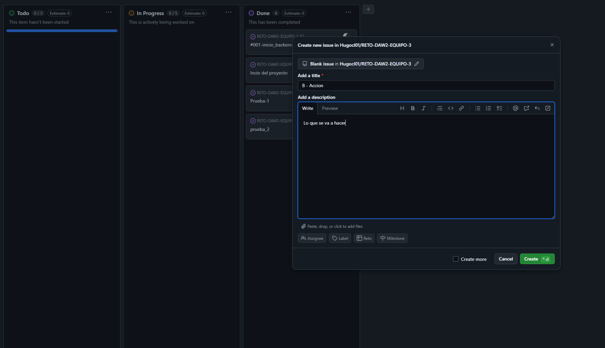
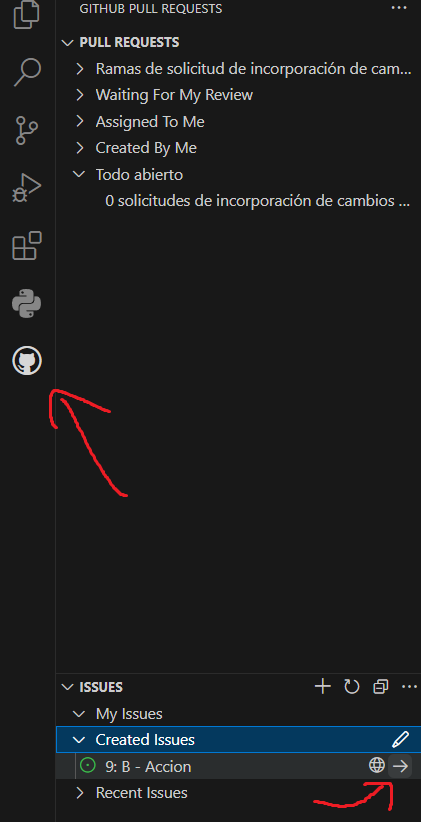

# RETO-DAW2-EQUIPO-3


# USO DE GITHUB

## Clonar (SOLO UNA VEZ PARA TENER EL PROYECTO):
```
git clone <URL>
```
## Actualizar rama principal (CADA VEZ QUE SE HAGA UNA FUNCIONALIDAD O CAMBIO):
```sh
git checkout main

git pull origin main
```
## Crear y cambiar a la rama:

La rama se crea desde project:



B - para Back

F - para Front

Para acceder a la rama creada:



## Comandos a tener en cuenta:

```
git status

Te dara el nombre de la rama y los cambios o adiciones al proyecto.
```

## Confirmar cambios:
```
git add .
git commit -m "Mensaje de commit"
```
## Subir cambios:
```
git push -u origin "nombre de la rama"
```
